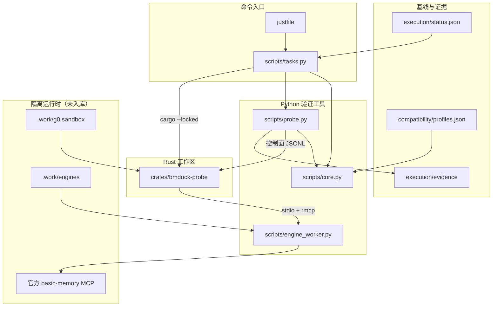

# BMDock — 仓库 AI 索引

> 上次全量扫描：2026-09-09 13:16 +08:00（`/init-projects`）
> 导航：[bmdock-probe](crates/bmdock-probe/CLAUDE.md) · [scripts](scripts/CLAUDE.md) · [tests](tests/CLAUDE.md) · [compatibility](compatibility/CLAUDE.md) · [docs](docs/CLAUDE.md) · [execution](execution/CLAUDE.md) · [.github](.github/CLAUDE.md)

Basic Memory 专用桌面工作台。目标技术栈：Tauri 2 + React/TypeScript + Rust/rmcp + 官方 Basic Memory。

当前仓库交付的是 **P0 / G0 技术验证工具**：固定引擎基线、隔离 sandbox、真实 MCP 探针、能力快照、文件物化 smoke tests、任务状态与跨平台命令。T08 另有 zh-CN 桌面布局壳；没有原生安装器，没有生产写入。G0 未通过。

`just dev` 启动 Tauri 桌面壳（与 `just tauri-dev` 相同）。`just build` 仍构建 `bmdock-probe`（CI 使用该入口，不是 Tauri）。`just dev-main` 仍是 main-preview 探针。`just tauri-build` 是桌面构建入口，不是安装器。`just contract*` 仍是真实引擎 smoke。

## 当前边界

- 探针只接入 `.work/g0` 下生成的 fixture 项目 `bmdock-fixture`。
- 禁止连接或修改用户真实 Obsidian vault、全局 Basic Memory 配置、Agent 配置。
- 禁止把 probe 控制通道当作未来桌面 IPC / raw `callTool` 接口。
- 禁止把 smoke 通过宣称为 G0 通过。`just gate` 在任一 G0–G7 未通过时返回非零。
- 禁止把 Python 单测当作真实引擎或原生桌面验收。
- 两套引擎 profile 不混用契约：`release` = Basic Memory v0.23.2 / 21 个 MCP 工具；`main-preview` = commit `3452c821…` / 27 个 MCP 工具。

## 架构

```text
justfile → python -m scripts.tasks
              ├─ isolated upstream checkout + uv.lock  (.work/engines)
              ├─ sandbox / config / environment policy (.work/g0)
              └─ crates/bmdock-probe
                    └─ official rmcp over stdin/stdout
                          └─ scripts/engine_worker.py  (官方 Basic Memory 进程)
```



数据所有权：应用不重写 Basic Memory 私有数据库，不创建第二套权威索引。引擎进程由 probe 持有；SDK 关闭与子进程退出分别计时；`forced` / 非零退出使 suite 失败；正常退出仍需 fixture 文件含预期内容才记该项通过。

## 模块索引

| 模块 | 路径 | 职责 | 索引 |
|---|---|---|---|
| bmdock-probe | `crates/bmdock-probe/` | 开发者 G0 探针：rmcp 客户端、方法/工具白名单、子进程所有权 | [CLAUDE.md](crates/bmdock-probe/CLAUDE.md) |
| scripts | `scripts/` | 跨平台任务分发、sandbox 策略、真实引擎 smoke、官方 CLI 清单 | [CLAUDE.md](scripts/CLAUDE.md) |
| tests | `tests/` | 无第三方依赖的 Python 单测（42 项） | [CLAUDE.md](tests/CLAUDE.md) |
| compatibility | `compatibility/` | 不可变引擎 profile 与静态工具基线 | [CLAUDE.md](compatibility/CLAUDE.md) |
| docs | `docs/` | 实施边界、源码证据、验证记录、G0 交接清单 | [CLAUDE.md](docs/CLAUDE.md) |
| execution | `execution/` | G0–G7 / T01–T40 状态与 CI 证据摘要 | [CLAUDE.md](execution/CLAUDE.md) |
| CI | `.github/` | Windows + Ubuntu `just setup/ci/build` | [CLAUDE.md](.github/CLAUDE.md) |

未实现：`apps/`、`packages/`、Tauri/React、产品 IPC。`.trellis/` 是 Trellis 工作流脚手架，spec 仍为占位；编码前读 `.trellis/workflow.md` 与 `.trellis/spec/`。

## 全局约定

1. **命令**：`justfile` 以 Python 为 recipe shell。等价入口 `python -m scripts.tasks <command>`。所有子进程使用固定 argv，`shell=True` 禁止。
2. **锁文件**：`Cargo.lock` 已提交。CI 使用 `--locked`，不重新解析依赖、不改写源码。显式重锁走 `just lock`，变更须审查后提交。
3. **联网**：`just setup` 是唯一主动下载引擎/Python 的任务。引擎安装到 `.work/engines/<profile>`，带 `.bmdock-engine.json` 标记；commit 不匹配则拒绝覆盖。
4. **隔离**：sandbox 从零生成；清除 provider key、Cloud 路由、`PYTHONPATH`。必填环境：`BASIC_MEMORY_AUTO_UPDATE=false`、`BASIC_MEMORY_SEMANTIC_SEARCH_ENABLED=false`、`BASIC_MEMORY_FORCE_LOCAL=true`。
5. **结果语义**：MCP `isError`、业务拒绝（`already_exists` / `locked` / `target_moved`）、`accepted_unverified`、磁盘可见、检索命中分开记录。未知结果禁止自动重试非幂等写入。
6. **阶段顺序**：`execution/status.json` 中 G0 未 `passed` 时，T05 及之后不得标 `completed`（`scripts/tasks.py` `check_source` 强制）。
7. **许可**：原创代码为 AGPL-3.0-or-later，见仓库根 `LICENSE` 与 `NOTICE`。`docs/sbom/lockfile-inventory.json` 是离线锁文件清单。漏洞扫描、人工法律复核、hosted CI 与 G7 仍为 UNVERIFIED。
8. **行尾**：`.gitattributes` 将文本文件固定为 LF。

## 工具链钉扎

| 项 | 值 |
|---|---|
| Rust toolchain | 1.90.0（`rust-toolchain.toml`；含 rustfmt、clippy） |
| Cargo workspace `rust-version` | 1.88（与 toolchain 通道并存） |
| rmcp | `=3.2.0`，features：`client`、`transport-async-rw` |
| 脚本宿主 Python | 3.13.5（CI `setup-python`；本地要求 ≥3.12，命令名 `python`） |
| 引擎 Python | uv 管理的 3.12.12 |
| uv / just | 0.12.11 / 1.40.0 |
| MCP 协议声明 | `2025-11-25`，clientInfo `BMDock-G0` |

版本升级必须显式审查，不以浮动 latest 替代锁定。

## 常用命令

| 命令 | 行为 |
|---|---|
| `just doctor` | 检查 git/uv/cargo/rustc/just 与 Python≥3.12；不启动 Basic Memory |
| `just setup` | 按 profile 浅克隆固定 commit，校验 tag，`uv sync --frozen` |
| `just ci` | Python 单测 + rustfmt + clippy `-D warnings` + cargo test/build + 两版真实引擎 smoke |
| `just ci-unit` / `python -m scripts.tasks unit` | 无第三方依赖单测 |
| `just dev` | T08 Tauri 桌面壳（与 `just tauri-dev` 相同） |
| `just dev-main` | 新 sandbox 中运行 main-preview 探针 |
| `just tauri-dev` / `just tauri-build` | 桌面开发入口 / 桌面构建入口；`tauri-build` 不是安装器 |
| `just contract` / `just contract-main` | 仅真实引擎 smoke |
| `just build` | G0 探针 `target/release/bmdock-probe[.exe]`（CI 仍使用；不是 Tauri） |
| `just gate` | 输出未通过门禁；当前应返回非零 |
| `just lock` | `cargo generate-lockfile` |

## 验证快照（截至 03c2839 / CI run 34309026376）

Windows 与 Ubuntu：`just ci`、`just build` 成功；Python 42 项、Rust 4 项、两版 smoke 均通过。G0 仍为 `in_progress`。未关闭项：丢响应故障注入、全部原文往返、真正并发写入、Windows junction/睡眠恢复、客户端限制、全部 resource/prompt 调用。细节见 [docs/VERIFICATION.md](docs/VERIFICATION.md) 与 [docs/G0_HANDOFF.md](docs/G0_HANDOFF.md)。

## 忽略路径

默认忽略：`target/`、`.work/`、`artifacts/`、`.venv/`、`__pycache__/`、二进制大文件、各 Agent 平台目录（`.claude/`、`.grok/`、`.codex/` 等，见 `.gitignore`）。

## 扫描覆盖（可断点续扫）

- 产品源码与文档：27 / 27 文件已读（不含 `Cargo.lock` 字节内容）。
- 工作区全树约 344 文件；其余主要为 `.trellis/` 脚手架与 `__pycache__`。
- 已识别产品模块 7 / 7，均已生成模块 `CLAUDE.md` 与面包屑。
- 跳过原因：生成物、平台配置、Trellis 内部脚本、Cargo 锁解析明细。
- 建议下次补扫：`.trellis/spec/bmdock-probe/backend/` 填实后的约定；T05 引入 Tauri/React 后的新模块；`artifacts/` 原始 smoke 报告（仅在本地/CI 产物存在时）。
